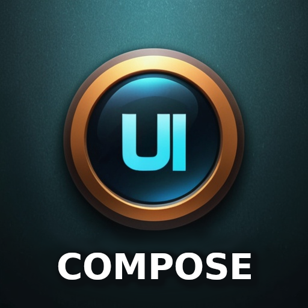
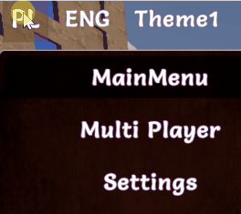
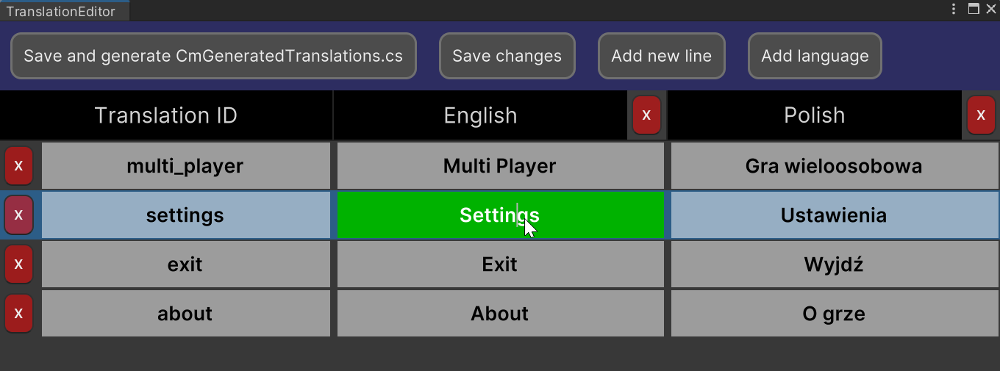
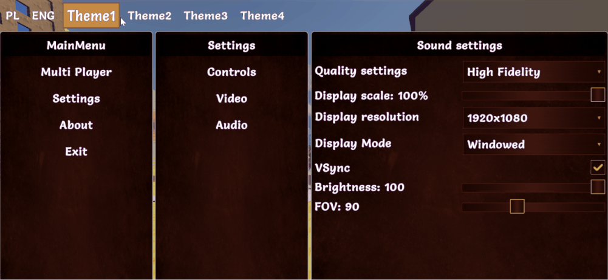
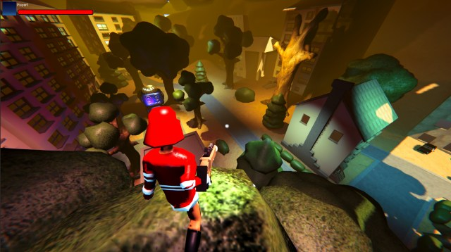
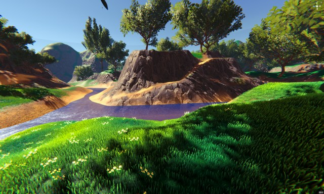
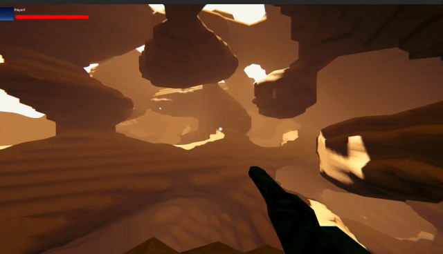
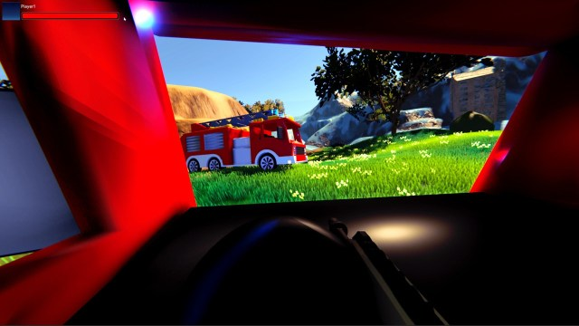

# UI Compose documentation version 1.0.0



Thank you for buying UI Compose. I hope it will speed up your workflow and help to finish your game faster 😄.

<!-- TOC -->
* [UI Compose documentation version 1.0.0](#ui-compose-documentation-version-100)
* [Demo executable:](#demo-executable)
* [The main **benefits** of UI Compose is:](#the-main-benefits-of-ui-compose-is)
  * [Note: this tool **include: FULLY working 3D multiplayer FPS (mirror/LAN) with**:](#note-this-tool-include-fully-working-3d-multiplayer-fps-mirrorlan-with)
  * [Some limitations of the current version of UI Compose:](#some-limitations-of-the-current-version-of-ui-compose)
    * [Detailed description of limitations enforced by UI toolkit](#detailed-description-of-limitations-enforced-by-ui-toolkit)
  * [UI Compose components](#ui-compose-components)
    * [Screen Manager (CmScreenManager)](#screen-manager-cmscreenmanager)
    * [Screen (CmScreen)](#screen-cmscreen)
    * [Theme (ICMThemeBase)](#theme-icmthemebase)
    * [Screen Part (CmScreenPart)](#screen-part-cmscreenpart)
    * [Controls](#controls)
    * [Modifiers](#modifiers)
    * [UI events](#ui-events)
    * [Tutorials](#tutorials)
<!-- TOC -->

# Demo executable:

You can download current demo here:


[Demo game with UI Compose menu in action](https://drive.google.com/file/d/1sLXTo1X5chfmrYf_n_eN2lLxLuhypJuJ/view?usp=sharing)

# The main **benefits** of UI Compose is:

- full source code included
- powerful styling in the code using probably all modifiers available in USS but using build-in functions - no more
  CSS/USS, [(more about here)](modifiers.md),
- build in nodes with screen preview so you can connect them by actions and use these actions to move between screens,
  but you can move between screens without it by just a simple method call with screen
  name [(more about here)](graph_editor.md)


-------------------------------------------------------

- language change and translation editor (built-in) [(more about here)](translation_editor.md)



You can add your custom Editors in Unity. You can check how (build-in) Translation Editor was made - because it was made
with UI Compose


-------------------------------------------------------------------

- theming and changing of the current theme! [(more about here)](theming.md)

  

---

- easy event handling! (you can handle events on part of your screen, screen as a whole, globally, or event in
  many places at the same time) [(more about here)](ui_events.md)
- UI compose contains controls from UI Toolkit and a few more, like a floating window, and a draggable panel. This will
  be probably improved in the future [(more about here)](visual_controls.md)
- implemented with observer pattern in mind to observe changes in UI or trigger UI changes from external events - all by
  observable fields, but by default it doesn't require that [(more about here)](cmlive_data.md)
- multiple scenes with examples like simple one theme, simple two themes, the scene with screen part, and game included
  with a few game scenes with maps and a main menu [(more about here)](tutorials.md)
- passing player data to UI by event callback
- screen changing by separations of concerns. All game screens will be handled by the screen manager which will contain
  your screen classes. Screens will contain sections ("ScreenPart") that can be reused anywhere in the game. So for
  example: the settings menu section could be added to in game menu by just one single line of code. You can omit
  sections code but it is recommended.
- build-in helper functions for your game and tools for multiplayer with a mirror
- persistent and also observable fields for settings for your options. Assign data to the field and forget about it.
- behaviors classes - allow you to assign specific behaviors for your controls. Currently, there is one behavior
  floating window behavior that will make control movable/draggable by mouse like windows in the operating system.
- **included: FULLY working 3D multiplayer FPS (mirror/LAN) with main menu and in-game
  menu ** [click here](multiplayer_game.md)

## Note: this tool **include: FULLY working 3D multiplayer FPS (mirror/LAN) with**:

- fully working menu with settings changes like resolution/refresh rate, sound, music, mouse sensitivity, and more,
- grappling hook weapon created from scratch using math in code for springs (without using the build in spring classes),
  so you can do more,
- car driving logic: spring camera attached to the seat and shooting while driving + free camera rotation +
  FPP/TPP camera during driving 😄,
- car models included,
- weapon recoil using spring,
- weapon attached to the hand bone
- jumping
- muzzle flashes,
- sounds for actions,
- health status,
- multiple weapons like pistol, machine-gun, grenade launcher, a sniper with simple zooming, and rocket launcher (models
  included with blender files .blend)
- weapon recoil
- maps for the game and simple models like trees, houses,
- you can play with friends on LAN






More about multiplayer games [click here](multiplayer_game.md)

Please read the below brief overview of all important sections that will help you to understand how it works all
together.

## Some limitations of the current version of UI Compose:

UI compose is styling controls by generating USS code in the background and has the same limitations as UI Toolkit (in
this version). The system will generate all styles for all your themes and selectors from the code to the
Resources/UssStyles folder and it will be loaded runtime.

### Detailed description of limitations enforced by UI toolkit

Currently UIToolkit enforces the limitation that USS code can't created and parsed runtime to style sheet
because The USS importer makes heavy use of the AssetDatabase to resolve asset paths. To make the importer
runtime-ready, the UI Toolkit needs to come up with other ways to resolve asset paths.

So that you can change any style of your controls (during project creation in the editor) for any selector for example :
Hover when the mouse is hovering over the control. This can be done before the final build and will work runtime, but we
can't generate runtime a new style.

UI Compose will build all styles and selectors for all you screens before final build so that you will be able to use it
runtime normally, but you won't be able to generate styles runtime. You can of course change styles runtime by using
fields from controls but not by USS code.

> Because of that the new version of UI Compose will propably depend only on dynamic code generation, but current
> version is enought - it works like UI Toolkit, so don't worry.

So, we can:

- create styles for any visual look before build and set at runtime to change it dynamically runtime,
- create custom selectors and activate/deactivate it runtime (that will change the visual look and feel of control for
  certain conditions)
- dynamically change the visual of any control by accessing the stylesheet property of any CmControl.getVisualElement()
  .stylesheet. So we can for example dynamically load any image and change it runtime.

Because of all of that - UI Compose has an additional custom selector that will allow you to execute runtime. So you
want to make control half opacity and red in certain conditions runtime. You will create that style for it with your
custom name and activate or deactivate that style runtime.

> Important!. **The next version** of the UI compose will be probably fully based on dynamic changes without using
> CSS/USS so any dynamic changes runtime would be dynamic by default.

---

> Anyway - all the unity UI Toolkit selectors will work normally in runtime, so you will normally create a style for
> each selector you want. For example when the mouse is hovered, when control is disabled, or checked:

```csharp
 var cmToggle = new CmToggle(..);
 cmToogle.modifiers.CheckMark(
     // create modifier for DEFAULT_STATE but we will add other state using ____NextSelector
     new CmModifierImageAndBackground(CmSelector.DEFAULT_STATE)
         .BorderWidth(0)
         .BorderRadius(60.px())
         .BorderColorRGBA(new Color32(255, 51, 4, 255))
   
         //Now add modifiers for HOVER state
         .____NextSelector(CmSelector.HOVER)
         .Scale(1.2f)
   
         //Now add modifiers for the DISABLED state
         .____NextSelector(CmSelector.DISABLED)
         .BackgroundColorRGBA(Color.white)
   
         //Now add modifiers for the CHECKED state
         .____NextSelector(CmSelector.CHECKED)
         .BackgroundColorRGBA(Color.gray)
 );
```

to learn more about changing visual look see [theming](theming.md), [modifiers](modifiers.md)
and [controls](visual_controls.md)

## UI Compose components

### Screen Manager (CmScreenManager)

The main component of UI Compose is **CmScreenManager** which is a container for all screens and themes in your game.
You can create many screen managers. For example: One for the main menu, and one for in-game. You Provide a list of *
*CmScreen** and a list of Themes CmThemeBase. Here you can handle global UI events by clicking on the buttons.
To learn more about it [click here](screen_manager.md)

### Screen (CmScreen)

This is a single screen visible as a whole on the monitor screen currently. The screen is tightly coupled with a theme.
If you don't use a theme then you can create a screen based on the default theme. Here you can handle screen-related UI
events like clicking on the buttons.
To learn more about it [click here](screen.md)

### Theme (ICMThemeBase)

The theme is just a base Interface inherited after **ICMThemeBase** which you will provide. It will contain methods
like:

```csharp
public interface CmExample1ThemeBase : ICMThemeBase
{
    public void StyleButton(CmButton button);
}
```

You will tell Screen Manager, or Screen that this interface will be used for theming, and create classes that will
inherit this interface to actually style your control with the implemented method. So you can use the base interface
when you create control and you won't worry about which theme is currently in use. You can have as many themes as you
want and easily change theme runtime.

To learn more about theming [click here](theming.md)

### Screen Part (CmScreenPart)

This is an optional element. It was added to divide the whole screen into sections. This way you can reuse certain
sections on multiple screens. Like the game settings panel for changes in the main menu and in the game. This way it's
more reusable. CmScreenPart is also usable to handle UI events (like button clicks or other events) and encapsulate this
logic to this screen part. Of course, you can handle events in higher order parts of your system like **CmScreen** or *
*CmScreenManager** you can handle screen part-related UI events like clicking on the buttons.

To learn more about CmScreenPart [click here](screen_part.md)

### Controls

UI Compose is an adapter for UI toolkit components with an extension. You can easily modify UI Toolkit controls as usual
that are attached to adaptee control. but you can easily handle UI events and styling without needing the "USS/CSS"
part.
To see all available controls at the moment please [click here](controls.md)

### Modifiers

Modifiers are properties that will change the look and feel of UI Toolkit controls like USS/CSS code, but they are
managed in the code. Modifiers were divided into categories to make it more intuitive while modifying the control style.
So for example you can have control with text that will have **CmModifierBackground** and more extensive modifier *
*CmModifierText** for Text elements like labels. It doesn't make sense to use text modifiers on images. But *
*CmModifierText** is an extension of **CmModifierBackground** so you can use all properties from the background on the
text element but you cannot use the text element on the background.

1. CmModifierText - for styling elements with text,
2. CmModifierBackground - for elements with background,
3. CmModifierImageAndBackground - for images,
4. CmModifierColumn and CmModifierRow - for column and row components,

to get more information about modifiers [click here](modifiers.md)

### UI events

UIEvents are mapped internally to simple Class. This way you can easily use events in any place of your elements tree.

The whole menu is built onto **CmScreenManager**, and next **CmScreen** which is attached to **CmScreenManager**, and
next CmScreenPart (optional) which is attached to CmScreen, and finally, CmControlBase which is added to CmScreenPart.

So basically there is a relation like this CmScreenManager <- CmScreen <- CmScreenPart <- CmControl

You can handle events the same way. The UI events are generated by CmControl. This event can be handled inside the
function that creates CmControl, or upper in CmScreenPart or upper CmScreen, or globally in CmScreenManager. This way
you can have a button "Change theme to My favorite" and handle click event (generated by this button) globally in
CmScreenManager. This way you will not repeat code related to changing themes inside each visible screen.

More about [UI events here](ui_events.md).

### Tutorials

UI compose contains a few sample scenes but it will be better to read the tutorial section
first [(here)](tutorials/tutorials.md)
