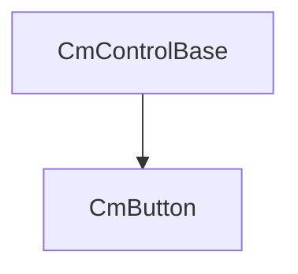

# UI Compose documentation

:arrow_backward: [Go back](../visual_controls.md).

<!-- TOC -->
* [UI Compose documentation](#ui-compose-documentation)
  * [introduction](#introduction)
<!-- TOC -->

## introduction



CmControlBase is the base control [more in the introduction here](../visual_controls.md)

# CmButton

CmButton is a button control. Is is based on VisualElement. 

```csharp
	CmButton someButton = new CmButton();
```

# Style CmButton elements

CmButton modifiers contains only one element to style - the "Button"

```csharp
    public CmButton OptionButton(bool enabled, string text, string name)
    {
        var button = new CmButton(text, cmUIEventsHandler: getUIEventsHandler());
        button.SetName(name);
        button.SetEnabled(enabled);
        
        // tyle Button element of Button control
        button.Modifiers.Button(
            new CmModifierText(CmSelector.DEFAULT_STATE)
                .BackgroundColorRGBA(new Color32(3, 3, 32, 255))
                .TextColorRGBA(new Color32(225, 225, 242, 255))
                .Weight(0)
                .FlexDontShrink()
                // for hover selector ==========================================================
                .____NextSelector(CmSelector.HOVER)
                .Scale(1.02f, 1.2f)
                .TextOutlineWidth(2)
                .TextOutlineColorRGBA(Color.black)
                .BackgroundImageTintRGBA(Color.cyan)
                .TextFontSize(39)
                // for focused selector ==========================================================
                .____NextSelector(CmSelector.FOCUS)
                .TextOutlineWidth(2)
                .TextFontSize(39)
                // copy common style from generic modifier builder 
                // (you can copy it in multiple places to reduce code)
                // (you can copy this on all selectors - so create your own fucntion with common modifiers and copy)
                .CopyFrom(scaleWithAnimation())
                // for disabled selector ==========================================================
                .____NextSelector(CmSelector.DISABLED)
                .BackgroundImageTintRGBA(_inputDisabledBgColor)
        );
        
        return button;
    }

    private CmModifierBuilder scaleWithAnimation()
    {
        return new CmModifierBuilder(CmSelector.DEFAULT_STATE)
            // animation for 300 milliseconds
            .AnimDuration(300)
            // scale control a little bit
            .Scale(1.02f, 1.05f);
    }
```

to learn about modifiers for all controls [click here](../modifiers.md)