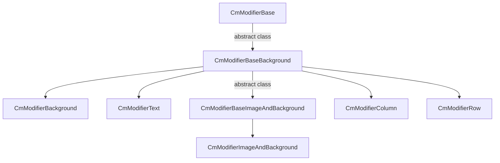

# UI Compose documentation


:arrow_backward: [Go back](README.md).

<!-- TOC -->
* [UI Compose documentation](#ui-compose-documentation)
* [Introduction](#introduction)
  * [Modifiers builder](#modifiers-builder)
  * [Base modifiers](#base-modifiers)
  * [Modifiers used by controls](#modifiers-used-by-controls)
* [How it works all together with controls](#how-it-works-all-together-with-controls)
  * [what is UssPropertyVal](#what-is-usspropertyval)
    * [So, how to create these values?](#so-how-to-create-these-values)
  * [Custom modifiers (for your own visual change for control runtime)](#custom-modifiers-for-your-own-visual-change-for-control-runtime)
  * [CmSelector (controls visual state)](#cmselector-controls-visual-state)
* [Simple list of all modifiers](#simple-list-of-all-modifiers)
    * [CmModifierBase modifiers](#cmmodifierbase-modifiers)
    * [CmModifierBaseBackground modifiers](#cmmodifierbasebackground-modifiers)
    * [CmModifierBaseImageAndBackground modifiers](#cmmodifierbaseimageandbackground-modifiers)
    * [CmModifierText modifiers](#cmmodifiertext-modifiers)
    * [CmModifierRow modifiers](#cmmodifierrow-modifiers)
    * [CmModifierColumn modifiers](#cmmodifiercolumn-modifiers)
    * [What next](#what-next)
<!-- TOC -->

# Introduction

All controls have their modifiers. For example, CmScrollView has modifiers for the background and modifiers for
vertical/horizontal scrollbars.

We need to change different properties for text elements but for background elements, there are fewer properties available
than for text. Because the text has font size/color etc. but the background does not.

## Modifiers builder

This is why modifier builder - the class that we will be using for building style for specific control is divided into
groups that inherit from other groups modifiers to build modifiers depend on their type like text, background etc.

This is how it looks



> Note: you shouldn't use classes with the text "**Base**" in their names from the above diagram. Only if you need to create
> your own class with your own modifiers that inherit from them.

## Base modifiers

- **CmModifierBase** - is the parent for all modifiers and contains generic modifiers.

> It will allow us to set properties like size, animation, padding, generic properties, border(color, radius, width),
> margin.

- **CmModifierBaseBackground** - extension from ``CmModifierBase``.

> It will allow us to set properties like background: color, image, image tint color, image slice, scale mode, repeat,
> position, size

- **CmModifierBaseImageAndBackground**  - extension from ``CmModifierBaseBackground``.

> It will allow you to set properties like image, image scale mode, image tint color

## Modifiers used by controls

- **CmModifierImageAndBackground** - this is child of base modifer ``CmModifierBaseImageAndBackground``.

---

- **CmModifierBackground** - this is child of base modifer ``CmModifierBaseBackground``.

---

- **CmModifierText** - used where we need to change anything related to text.

---
> You can change properties like: text(color, outline color, size, font, alignment, outline width etc),
> multiline/single-line etc.

- **CmModifierColumn** is an extension for CmModifierBaseBackground that contains only two new methods:

```csharp
        public CmModifierColumn HorizontalAlignment(CmAlignment alignment);
        public CmModifierColumn VerticalArrangement(CmArrangement arrangement);
```

---

- **CmModifierRow** is similar to CmModifierColumn and it is an extension for CmModifierBaseBackground that contains only
  two new methods:

```csharp
        public CmModifierRow HorizontalArrangement(CmArrangement arrangement)
        public CmModifierRow VerticalAlignment(CmAlignment alignment)
```

---
> Note: As you can see **CmModifierColumn** has ``horizontalAlignment`` but **CmModifierRow**
> has ``HorizontalArrangement``, the same difference is for vertical space. This is because the CmColumn is vertical
> container,
> but CmRow is a horizontal container. The same rules affect html/css controls.

---
# How it works all together with controls

All controls have a field called ``Modifiers``which is a class that allows you to style elements of these controls like
background, label, scrollbars, etc.

Some controls have many elements like CmScrollView. But for example, let's take a look at CmToogle control. This is simple
toggle button.

**CmToogle** has a ``Modifiers`` field that contains methods to style elements of CmToogle control like Background, Label,
CheckMarkBackground and CheckMark

```csharp
        public CmToggleModifiers Background(CmModifierBackground modifier)
        public CmToggleModifiers Label(CmModifierText modifier)
        public CmToggleModifiers CheckMarkBackground(CmModifierBackground modifier)
        public CmToggleModifiers CheckMark(CmModifierImageAndBackground modifier)
```

so you can style any element of toggle control by using:

```csharp
 var cmToggle = new CmToggle(..);
 
 var modifiers = cmToogle.Modifiers;
 
 // change CheckMarkBackground
 modifiers.CheckMarkBackground(...)
     
 // change checkmark
 modifiers.CheckMark(...)
     
 // change Label
 modifiers.Label(...)
```

> Note: each method allows you to style other elements and because the label is not background it will use different Modifiers
> builder. **Label** contains text so it uses **CmModifierText**, but the **Background** is just a simple background, so
> text modifiers are useless here so we hide its methods by using a less extended modifier builder like *
*CmModifierBackground**.

Here is how to style the checkmark element which contains the image and background so it uses **CmModifierImageAndBackground**
modifier:

```csharp
 var cmToggle = new CmToggle(..);
 cmToogle.Modifiers.CheckMark(
     // create modifier for DEFAULT_STATE but we will add other states using ____NextSelector
     new CmModifierImageAndBackground(CmSelector.DEFAULT_STATE)
         .BorderWidth(0)
         .BorderRadius(60.px())
         .BorderColorRGBA(new Color32(255, 51, 4, 255))
     
         //Now add modifiers for HOVER state
         .____NextSelector(CmSelector.HOVER)
         .Scale(1.2f)
     
         //Now add modifiers for the DISABLED state
         .____NextSelector(CmSelector.DISABLED)
         .BackgroundColorRGBA(Color.white)
     
         //Now add modifiers for the CHECKED state
         .____NextSelector(CmSelector.CHECKED)
         .BackgroundColorRGBA(Color.gray)
 );
```

This code can have multiple lines because you would want to change many modifiers, but it's simple to understand and
easier to maintain than the USS code.

Additionally, you will not have to know the class name for the toggle checkmark to change it and modifiers will
hide difficult flex uss code behind simple API.

---
## what is UssPropertyVal

Many modifiers allow you to set parameters as percents, pixels, or others. These modifiers will accept parameters with
int type which will be converted to pixels internally in USS.

There are also overloaded versions of these modifier functions that will accept parameters as **UssPropertyVal**.

**UssPropertyVal** is a special conversion class generated automatically from your int/float/double parameters that will
be converted to pixels/percents/other.

> Important: You won't have to create this class because it will be created automatically when you use the extension
> function on int/float/double values.

### So, how to create these values?

here is an example of that

```csharp
 cmToogle.Modifiers.CheckMark(
     // create modifier for DEFAULT_STATE but we will add other state using ____NextSelector
     new CmModifierImageAndBackground(CmSelector.DEFAULT_STATE)
         .BorderWidth(4.px())
 );
 
```

in this example, BorderWidth accepts **UssPropertyVal** but it was automatically created from int value "4" converted
by extension function "px()" to **UssPropertyVal** class

you can use extension functions on base types int/float/double in some exceptions:

| extension function | out class      | convert to        |
|--------------------|----------------|-------------------|
| .px()              | UssPropertyVal | pixel values      |
| .percent()         | UssPropertyVal | percentage values |
| .em()              | UssPropertyVal | font em values    |
| .rem()             | UssPropertyVal | font rem values   |
| .deg()             | UssPropertyVal | rotation values   |
| .rad()             | UssPropertyVal | rotation values   |
| .grad()            | UssPropertyVal | rotation values   |


Another example. If you want to set font size using "em()"

```csharp
 cmToogle.Modifiers.CheckMark(
     // create modifier for DEFAULT_STATE but we will add other state using ____NextSelector
     new CmModifierImageAndBackground(CmSelector.DEFAULT_STATE)
         .TextFontSize(12.em())
 );
```

---
## Custom modifiers (for your own visual change for control runtime)

Suppose that for example, you want to hide a label using USS code for the UI toolkit using your custom modifier.

```csharp
 var cmToggle = new CmToggle(..);
 
 //Create a custom selector for the label with the name: "your_custom_selector_name_enter_here"
 cmToogle.Modifiers.Label(
     new CmModifierText(CmSelector.DEFAULT_STATE, "your_custom_selector_name_enter_here")
         .Hide()
 );
 
 //------------------------ 
 // then runtime
 
 //Add your selector to hide the label
 cmToggle.SetCustomSelector("your_custom_selector_name_enter_here");
 
 // to remove your selector to show the label
 cmToggle.RemoveCustomSelector("your_custom_selector_name_enter_here");
```

---
## CmSelector (controls visual state)

The selector is something like a state of control. Here is the list of states

```csharp
    /// <summary>
    /// Use this to build a selecor for control. For example when you want to change style when the mouse is over a control.
    /// This is a pseudo Class Type of visual element eg. selector.
    /// </summary>
    public enum CmSelector
    {
        /// default style
        DEFAULT_STATE,

        /// The cursor is positioned over the element.
        HOVER,

        /// A user interacts with the element. Button click for example.
        ACTIVE,

        /// A user stops to interact with the element.
        INACTIVE,

        /// The element has focus.
        FOCUS,

        /// USS doesn’t support this pseudo-state. Use :checked instead.
        SELECTED,

        /// The element is in a disabled state.
        DISABLED,

        /// The element is in an enabled state.
        ENABLED,

        /// The element is a Toggle or RadioButton element and it’s selected.
        CHECKED,

        /// The element is the highest-level element in the visual tree
        ROOT
    }
```

DEFAULT_STATE is the state when control is visible on the screen and nothing is changed with its state. You will always use this state for styling. Typically you will also style control for HOVER and DISABLED states to change how the control will look while the mouse is hovering over it, or when the control is disabled. Here is an example of how to style these three states:


```csharp
 var cmToggle = new CmToggle(..);
 cmToogle.Modifiers.CheckMark(
     // create modifier for DEFAULT_STATE but we will add other states using ____NextSelector
     new CmModifierImageAndBackground(CmSelector.DEFAULT_STATE)
         .BorderWidth(0)
         .BorderRadius(60.px())
         .BorderColorRGBA(new Color32(255, 51, 4, 255))
     
         //Now add modifiers for HOVER state
         .____NextSelector(CmSelector.HOVER)
         .Scale(1.2f)
     
         //Now add modifiers for the DISABLED state
         .____NextSelector(CmSelector.DISABLED)
         .BackgroundColorRGBA(Color.white)
 );
```

---
# Simple list of all modifiers

Here are all modifiers available in version 1.0.0 of UI Compose.

Modifiers will be divided into sections based on the mentioned earlier ModifierBuilders

### CmModifierBase modifiers

```csharp
    // left, top, right, bottom
    public T LeftInitial();
    public T RightInitial();
    public T TopInitial();
    public T BottomInitial();
    public T Left(int left);
    public T Left(UssPropertyVal left);
    public T Right(int right);
    public T Right(UssPropertyVal right);
    public T Top(int top);
    public T Top(UssPropertyVal top);
    public T Bottom(int bottom);
    public T Bottom(UssPropertyVal bottom);

    // size related
    public T Width(int width);
    public T Width(UssPropertyVal width);
    public T FillMaxWidth(float factor);
    public T WidthWrapContent();
    public T WidthAuto();
    public T FillParentWidth();
    
    public T Height(int height);
    public T Height(UssPropertyVal height);
    public T FillMaxHeight(float factor);
    public T HeightWrapContent();
    public T HeightAuto();
    public T FillParentHeight();
    public T Weight(float weight = 1.0f);
    
    // animation
    public T AnimEnable(bool enable = true);
    public T AnimDuration(int durationMillisecond = 1);
    public T AnimDelay(int delayMillisecond = 1);
    public T AnimEasing(CmAnimationEasing cmAnimationEasing);
    public T AnimEasingInitial();
    public T AnimDelayInitial();
    public T AnimDurationInitial();
    public T AnimEnableInitial();
    
    // pading
    public T PaddingAll(UssPropertyVal left, UssPropertyVal top, UssPropertyVal right, UssPropertyVal bottom);
    public T PaddingLeft(UssPropertyVal left);
    public T PaddingRight(UssPropertyVal right);
    public T PaddingTop(UssPropertyVal top);
    public T PaddingBottom(UssPropertyVal bottom);
    public T PaddingHorizVert(UssPropertyVal horizontalPadding, UssPropertyVal verticalPadding);
    public T PaddingAll(int left, int top, int right, int bottom);
    public T PaddingLeft(int left);
    public T PaddingRight(int right);
    public T PaddingTop(int top);
    public T PaddingBottom(int bottom);
    public T PaddingHorizVert(int horizontalPadding, int verticalPadding);
    
    // visibility
    public T Opacity(float opacity = 1.0f);
    public T Invisible();
    public T Hide();
    public T Show();

    // position related to parent
    public T PositionRelativeToParent();
    public T PositionAbsoluteInFirstRelativeParent();

    public T FreeFloatingWorldSpace();
    public T AttachToParent();
    public T DetachFromAllParents();

    // scale
    public T Scale(int scale);
    public T Scale(UssPropertyVal scale);
    public T Scale(float scale);
    public T Scale(int x, int y);
    public T Scale(UssPropertyVal x, UssPropertyVal y);
    public T Scale(float x, float y);

    // transform rotate/move/translate
    public T Rotate(UssPropertyRotationVal angle);
    public T Move(UssPropertyVal tx, UssPropertyVal ty);
    public T Translate(UssPropertyVal tx, UssPropertyVal ty);

    // orygin
    public T OriginCornerTopLeft();
    public T OriginCornerTopRight();
    public T OriginCornerBottomLeft();
    public T OriginCornerBottomRight();
    public T OriginAtCenterPoint();
    public T OriginEdgeLeftCenter();
    public T OriginEdgeTopCenter();
    public T OriginEdgeRightCenter();
    public T OriginEdgeBottomCenter();
    public T OriginPoint(UssPropertyVal tx, UssPropertyVal ty);

    // overflow (it means clip/no clip children controls to not draw over parent borders)
    public T OverflowVisible();
    public T OverflowHidden();
    public T OverflowClip();
    public T OverflowScroll();
    public T AlignSelf(CmAlignment alignment);
    public T AlignSelfInitial();

    // min max width/height
    public T MinWidthInitial();
    public T MinHeightInitial();
    public T MaxWidthInitial();
    public T MaxHeightInitial();
    public T MinWidth(int minWidth);
    public T MinWidth(UssPropertyVal minWidth);
    public T MinHeight(int minHeight);
    public T MinHeight(UssPropertyVal minHeight);
    public T MaxWidth(int maxWidth);
    public T MaxWidth(UssPropertyVal maxWidth);
    public T MaxHeight(int maxHeight);
    public T MaxHeight(UssPropertyVal maxHeight);

    // flex modifiers for more advanced usage similar to USS
    public T FlexShrinkInitial();
    public T FlexGrowInitial();
    public T FlexBasisInitial();
    public T FlexShrink(int shrink);
    public T FlexShrink(UssPropertyVal shrink);
    public T FlexDontShrink();
    public T FlexAllowShrink();
    public T FlexGrow(int grow);
    public T FlexGrow(UssPropertyVal grow);
    public T FlexDontGrow();
    public T FlexAllowGrow();
    public T FlexBasis(int basis);
    public T FlexBasis(UssPropertyVal basis);
    public T FlexBasisAuto();
    
    // border color
    public T BorderColorRGB(Color color);
    public T BorderColorRGBA(Color color);
    public T BorderColorHex(string hexColor);
    public T BorderColorRGBA(Color32 color);
    public T BorderColorRGB(Color32 color);
    public T BorderColorTransparent();
    
    
    // border radius
    public T BorderRadius(int radius);
    public T BorderRadiusLeftTop(int radius);
    public T BorderRadiusLeftBottom(int radius);
    public T BorderRadiusRightTop(int radius);
    public T BorderRadiusRightBottom(int radius);
    public T BorderRadiusInitial();
    public T BorderRadiusLeftTopInitial();
    public T BorderRadiusLeftBottomInitial();
    public T BorderRadiusRightTopInitial();
    public T BorderRadiusRightBottomInitial();

    public T BorderRadius(UssPropertyVal radius);
    public T BorderRadiusLeftTop(UssPropertyVal radius);
    public T BorderRadiusLeftBottom(UssPropertyVal radius);
    public T BorderRadiusRightTop(UssPropertyVal radius);
    public T BorderRadiusRightBottom(UssPropertyVal radius);
    
    // border width
    public T BorderWidth(int borderWidth);
    public T BorderWidthLeft(int borderWidth);
    public T BorderWidthBottom(int borderWidth);
    public T BorderWidthTop(int borderWidth);
    public T BorderWidthRight(int borderWidth);
    public T BorderWidth(UssPropertyVal borderWidth);
    public T BorderWidthLeft(UssPropertyVal borderWidth);
    public T BorderWidthBottom(UssPropertyVal borderWidth);
    public T BorderWidthTop(UssPropertyVal borderWidth);
    public T BorderWidthRight(UssPropertyVal borderWidth);
    
    // margin
    public T Margin(UssPropertyVal margin);
    public T MarginAll(UssPropertyVal left, UssPropertyVal top, UssPropertyVal right, UssPropertyVal bottom);
    public T MarginLeft(UssPropertyVal left);
    public T MarginRight(UssPropertyVal right);
    public T MarginTop(UssPropertyVal top);
    public T MarginBottom(UssPropertyVal bottom);
    public T MarginHorizVert(UssPropertyVal horizontalMargin, UssPropertyVal verticalMargin);
    public T Margin(int margin);
    public T MarginAll(int left, int top, int right, int bottom);
    public T MarginLeft(int left);
    public T MarginRight(int right);
    public T MarginTop(int top);
    public T MarginBottom(int bottom);
    public T MarginHorizVert(int horizontalMargin, int verticalMargin);

    public T MarginLeftInitial();
    public T MarginRightInitial();
    public T MarginTopInitial();
    public T MarginBottomInitial();
```

### CmModifierBaseBackground modifiers

```csharp
    // background color
    public T BackgroundColorRGB(Color color);
    public T BackgroundColorRGBA(Color color);
    public T BackgroundColorHex(string hexColor);
    public T BackgroundColorRGBA(Color32 color);
    public T BackgroundColorRGB(Color32 color);
    public T BackgroundColorTransparent();

    // background image
    public T BackgroundImageRes(string path);
    public T BackgroundImageUrl(string path);
    public T BackgroundIcon(CmUnityIcons cmUnityIcons);
    public T BackgroundImageInitial();
    
    // background image tint color
    public T BackgroundImageTintRGB(Color color);
    public T BackgroundImageTintRGBA(Color color);
    public T BackgroundImageTintHex(string colorHex);
    public T BackgroundImageTintRGBA(Color32 color);
    public T BackgroundImageTintRGB(Color32 color);
    public T BackgroundImageTintTransparent();
    
    
    // background image slice (for proper image scalling like 9 patch)
    public T BackgroundImageSliceLeft(int sliceValue);
    public T BackgroundImageSliceRight(int sliceValue);
    public T BackgroundImageSliceTop(int sliceValue);
    public T BackgroundImageSliceBottom(int sliceValue);
    public T BackgroundImageSliceScale(int sliceScale);
    public T BackgroundImageSliceScale(UssPropertyVal sliceScale);
    public T BackgroundImageSliceLeftInitial();
    public T BackgroundImageSliceRightInitial();
    public T BackgroundImageSliceTopInitial();
    public T BackgroundImageSliceBottomInitial();
    public T BackgroundImageSliceScaleInitial();
        
    // background scale
    public T BackgroundScaleMode(CmBackgroundScaleMode cmBackgroundScaleMode);
    public T BackgroundScaleModeInitial();
    
    // background repeat
    public T BackgroundRepeat(CmBackgroundRepeat cmBackgroundRepeat);
    
    // background position
    public T BackgroundPositionX(CmBackgroundPosition positionX);
    public T BackgroundPositionY(CmBackgroundPosition positionY);
    public T BackgroundPositionX(int positionX);
    public T BackgroundPositionY(int positionY);
    public T BackgroundPositionX(UssPropertyVal positionX);
    public T BackgroundPositionY(UssPropertyVal positionY);
    
    // background size
    public T BackgroundSize(UssPropertyVal bgSize);
    public T BackgroundSizeContainInArea();
    public T BackgroundSizeCoverArea();
```

### CmModifierBaseImageAndBackground modifiers

```csharp
    // image
    public T ImageRes(string path);
    public T ImageUrl(string path);
    public T UnityIcon(CmUnityIcons cmUnityIcons);
    public T ImageInitial();
    
    // image
    public T ImageScaleMode(CmImageScaleMode cmImageScaleMode);
    
    // image tint color
    public T ImageTintColorRGB(Color color);
    public T ImageTintColorRGBA(Color color);
    public T ImageTintColorHex(string hexColor);
    public T ImageTintColorRGBA(Color32 color);
    public T ImageTintColorRGB(Color32 color);
    public T ImageTintColorTransparent();
```

### CmModifierText modifiers


```csharp
    // text color in different formats
    public T TextColorRGB(Color color);
    public T TextColorRGBA(Color color);
    public T TextColorHex(string hexColor);
    public T TextColorRGBA(Color32 color);
    public T TextColorRGB(Color32 color);
    public T TextColorTransparent();
    
    // text font style
    public T TextFontStyle(CmFontStyle fontStyle);
    // text font outline width
    public T TextOutlineWidth(int w);
    public T TextOutlineWidth(UssPropertyVal w);
    
    // text align
    public T TextAlign(CmTextAlign cmTextAlign);
    
    // text font size
    public T TextFontSize(int value);
    public T TextFontSize(UssPropertyTextVal value);
    public T TextFontSize(CmFontSizeName fontSizeName);
    
    // text overflow position
    public T TextOverflowPosition(CmTextOverflowPosition cmTextOverflowPosition);
    public T TextOverflowInitial();
    
    // text font loading
    public T TextFontRes(string path);
    public T TextFontUrl(string path);
    public T TextFontInitial();
    
    // text whitespaces
    public T TextWhiteSpace(CmTextWhiteSpace textWhiteSpace);
    
    // text singleline/multiline
    public T TextMultiline();
    public T TextSingleLine();
    
    // text outline
    public T TextOutlineColorRGB(Color color);
    public T TextOutlineColorRGBA(Color color);
    public T TextOutlineColorHex(string hexColor);
    public T TextOutlineColorRGBA(Color32 color);
    public T TextOutlineColorRGB(Color32 color);
    public T TextOutlineColorTransparent();
```

### CmModifierRow modifiers


```csharp
    // layout direction (shouldn't be used in CmRow control)
    public T LayoutDirection(CmLayoutDirection layoutDirection);
    
    // horizontal and vertical (this is inverted in CmModifierColumn)
    public T HorizontalArrangement(CmArrangement arrangement);
    public T VerticalAlignment(CmAlignment alignment);
```


### CmModifierColumn modifiers


```csharp
    // layout direction (shouldn't be used in CmColumn control)
    public T LayoutDirection(CmLayoutDirection layoutDirection);
    
    // horizontal and vertical (this is inverted in CmModifierRow)
    public T HorizontalAlignment(CmAlignment alignment);
    public T VerticalArrangement(CmArrangement arrangement);
```

### What next

Because documentation will be probably changing less frequently than code - the description for these modifiers was not pasted here.

You will find documentation for specified modifiers inside the code comment for the modifier function.

[In the controls seciton](visual_controls.md) there is styling applied to individual controls and their elements