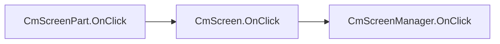

# UI Compose documentation

:arrow_backward: [Go back](README.md).

### Introduction

**CmScreenPart** is a part of the screen container for controls. This is an optional component. You can add controls to screens
directly, but this separation of concerns will help you manage larger projects and reuse parts of your screen UI. You
can have multiple **CmScreenPart** added to **CmScreen**.

### How to use

> NOTE: Before you will read about CmScreenPart please read about theming [here](theming.md),
> CmScreenManager [here](screen_manager.md) and CmScreen [here](screen.md). This way you will understand how it's working
> all-together

To create your own **CmScreenPart** you will have to select if you will use theme or not.

> NOTE: If you won't use the theme then you can pass the default builtin **CmThemeDefault** empty theme interface like in
> example below:

```csharp
    // CmThemeDefault will be used as a base theme and this is the empty theme for filling purposes
    public class MyMainScreen : CmScreen<CmThemeDefault>
    {
        ...
        // needed constructor 
        public MyMainScreen(CmScreenManager<CmThemeDefault> parent = null, VisualElement root = null) 
            : base(parent, root) {}
        
        ...
    }
```

But in the theming section of the documentation we created a base interface for theme **IMyExampleTheme** and two
implementations of themes **MyThemeWhite** and **MyThemeBlack**:

So let's use this here. This is how it would look like

```csharp
    // CmThemeDefault will be used as a base theme and this is the empty theme for filling purposes
    public class CmScreenPartTopSectionExampleSP : CmScreenPart<IMyExampleTheme>
    {
        public CmScreenPartTopSectionExampleSP(CmScreen<IMyExampleTheme> screen) : base(screen)
        {
        }

        public override void BindUIEventsOnStart(CmUIEventsHandler eventsHandler)
        {
        }

        public override CmControlBase MakeContent()
        {
            var row = new CmRow();
            GetTheme().StyleScreenPartContentRow(row);
            
            row.AddContent(OptionButton("Theme1", "Theme1"));
            row.AddContent(OptionButton("Theme2", "Theme2"));
            return row;
        }

        public CmButton OptionButton(string text, string name)
        {
            var button = new CmButton(text, cmUIEventsHandler: getUIEventsHandler());
            button.SetName(name);
            GetTheme().StyleButton(button);
            return button;
        }
    }
```

This is a simple screen part that could be reused on screens.

### MakeContent()

The screen part is not CmControl. So when you want to add it to the screen you need to create content with controls from this
screen part.
That is why there is a method **MakeContent**() which will return some control or container with controls.

In the above example, the content is built with a CmRow control container with two CmButtons added.
To learn more about controls see [there](controls.md)

### BindUIEventsOnStart()

Here **BindUIEventsOnStart**() function is the same as in CmScreenManager, CmScreen but you can handle UI event
whenever you want.

CmScreenPart is the lowest place where you can handle events. Events will go up and will be handled in such direction :



So you can handle events whenever you want.

> Note: when you create control you will pass CmUIEventsHandler as a parameter. You will have to pass CmUiEventHandler for
> current CmScreenPart by using the method of CmScreenPart.getUIEventsHandler(). This way events will be propagated upper in the view
> hierarchy like in the above diagram. If you create your event handler and pass it or null, then CmScreenPart and its
> parent won't know about the event being triggered so you won't receive events in BindUIEventsOnStart(). To learn more
> about events click [here](ui_events.md)