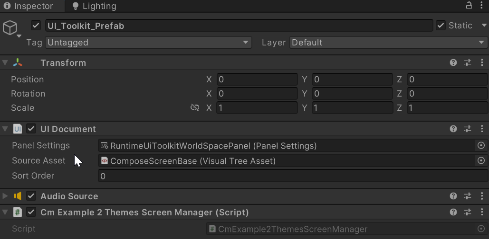
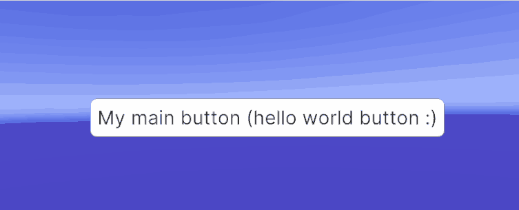
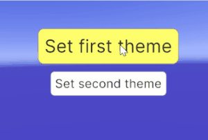
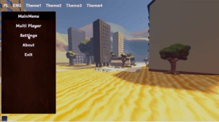

# UI Compose documentation

# Introduction

All below scenes contains UI_Toolkit_Prefab located in tool subfolder **ui_prefabs/UI_Toolkit_Prefab.prefab**

Just add it to the scene and attach your own Screen Manager Monobehaviour.

Or you can just create an empty object in the scene and add a UI document to it with typical panel settings and add an empty Source
Asset (don't add your controls just add empty because it will be used by UI Compose as a UI document)

# Tutorials

There are a few tutorial scenes added. Tutorials are placed in **examples** folder. Here is a list

### Simple one theme scene

- Scene is placed in **examples\simple\one_theme\scenes\OneThemeExampleScene.unity**. This scene contains simple buttons
  styled by one theme. An example is simple for faster learning purposes.

### Simple two theme scene with click actions

- Scene is placed in **examples\simple\two_themes\scenes\TwoThemesExampleScene.unity**. This scene is an extended version
  of the One Theme example. You can change the theme runtime.

### Simple CmScenePart usage example scene

- simple scene using CmScenePart. Scene is placed in **examples\simple\screen_part\scenes\ScreenPartExampleScene.unity
  **. This scene is an extended version of the One Theme example that just uses CmScreenPart as an example.

## Advanced tutorials

### Advanced full working game menu scenes.

- Scene is placed in **examples\advanced\scenes\ScreenPartExampleScene.unity**. This scene is an extended version of One
  Theme example that just uses CmScreenPart as an example.

