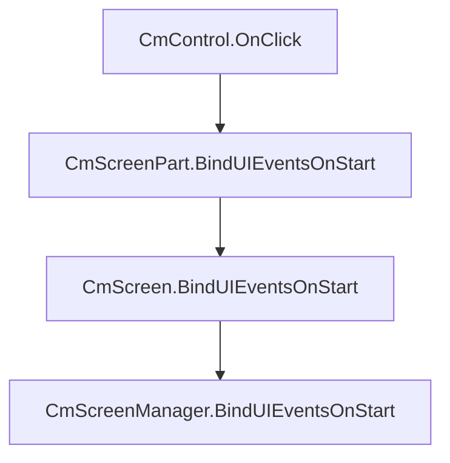

# UI Compose documentation


:arrow_backward: [Go back](README.md).

## CmUIEventsHandler

UI events are mapped internally to simple Class **CmUIEventsHandler**. This way you can easily use events in any place
of your elements tree.

The whole menu is built onto:

- **CmScreenManager**,
- **CmScreen** which is attached to **CmScreenManager**,
- **CmScreenPart** (optional) which is attached to **CmScreen**,
- finally your selected **CmControl** like CmToggle, or CmButton which is added to **CmScreenPart**

> Note: CmScreenPart is a helper class to manage everything into sections it is optional. So you can omit CmScreenPart
> from the above list and add your control to CmScreen directly.

### BindUIEventsOnStart()

**BindUIEventsOnStart**() function is used to bind your event handling logic. For example on click event when the user
select the button "Start game"

This function exists in CmScreenManager, CmScreen, or CmScreenPart.

Below is a part of the code for the main menu panel of the included example multiplayer game

```csharp
    public class MainMenuPanelSp : CmScreenPart<ICmThemeTestBase>
    {
        
        public override void BindUIEventsOnStart(CmUIEventsHandler uiEventsHandler)
        {
            uiEventsHandler.ButtonClick = control =>
            {
                //If the control name is "MultiPlayer" then the user clicks the button "MultiPlayer"
                if (control.GetName().Equals("MultiPlayer"))
                {
                    // SetCurrentScreen() is CmScreenPart function that will change the current screen by its name
                    // ScreenTypes is an enum, so screens have enum names converted to a string
                    //Using an enum helps to reduce magic strings here and there in-app, but also you can use this enum for screen names in many places 
                    SetCurrentScreen(ScreenTypes.MAIN_MENU_MAP_SELECT.ToString());
                }
                
                //If the control name is "Exit" then the user clicks the button "Exit"
                if (control.GetName().Equals("Exit"))
                {
                    Application.Quit(0);
                }
            };
        }
    }
```

CmScreenPart is the lowest place where you can handle BindUIEventsOnStart events. Events will go up and will be handled
in such direction :



So event will move through parents until it reaches the target which is CmScreenManager.
You can handle onClick event on each step simultaneously. This way you can add on click sound globally for each onClick
from all controls and add on click in CmScreenPart to handle some logic.

> Note: You won't have to create an instance of CmUIEventsHandler, because it is created internally for each class
> **CmScreenPart, CmScreen, CmScreenManager**. Each CmUIEventsHandler instance has a
> parent. ``CmScreenPart.CmUIEventsHandler`` has parent of ``CmScreen.CmUIEventsHandler`` etc. This way events will go
> up
> the parent's tree until they reach the grandparent CmScreenManager and propagation will stop.

### CmUIEventsHandler

when you create your control you will have to pass CmUIEventsHandler instance.

```csharp

    public class PlayerInGameStatsSp : CmScreenPart<ICmThemeTestBase>
    {
        
        public override void BindUIEventsOnStart(CmUIEventsHandler uiEventsHandler)
        {
            // handle image click or whatever
            ...
        }
            
        public CmImage createUserImage()
        {
            // so let's pass built-in event handler from PlayerInGameStatsSp
            var image = new CmImage(this.getUIEventsHandler());
            return image;
        }
        
        ...
    }
```

> If you create your instance of **CmUIEventsHandler** and pass it to the control constructor or pass null, then
> CmScreenPart and its
> Parent won't know about the event being triggered in controls so you won't receive events in BindUIEventsOnStart().

Of course, you can create your event handler like this, but you will have to handle events by yourself

```csharp

    public class PlayerInGameStatsSp : CmScreenPart<ICmThemeTestBase>
    {
            
        public CmButton createExitButton()
        {
            var eventHandler = new CmUIEventsHandler("MyEventHandler");
            var button = new CmButton(eventHandler);
            button.setName("Exit");
            
            eventHandler.ButtonClick = control =>
            {
                //If the control name is "Exit" then the user clicks the button "Exit"
                if (control.GetName().Equals("Exit"))
                {
                    Application.Quit(0);
                }
            };
            
            //But now you will have to handle events using your event handler
            return button;
        }
        
        ...
    }
```

### available events from CmUIEventsHandler

CmUIEventsHandler has actions that will be called by controls when the event occurs in control. Here is a list

```csharp

    public class CmUIEventsHandler{
        .....
        public Action<CmControlBase, GeometryChangedEvent> GenericOnGeometryChange = null;
        public Action<CmControlBase, PointerDownEvent> GenericPointerDown = null;
        public Action<CmControlBase, PointerUpEvent> GenericPointerUp = null;
        public Action<CmControlBase, PointerMoveEvent> GenericPointerMove = null;
        public Action<CmControlBase, PointerOutEvent> GenericPointerOut = null;
        public Action<CmControlBase> GenericMouseDown = null;
        public Action<CmControlBase, ClickEvent> GenericClick = null;
        public Action<CmControlBase> GenericMouseUp = null;
        public Action<CmControlBase> GenericMouseEnter = null;
        public Action<CmControlBase> GenericMouseLeave = null;
        public Action<CmControlBase> GenericKeyUp = null;
        public Action<CmControlBase> GenericKeyDown = null;
        public Action<CmButton> ButtonClick = null;
        public Action<CmTextField, String> TextFieldChange = null;
        public Action<CmToggle, Boolean> ToggleCheckChange = null;
        public Action<CmRadioButton, Boolean> RadioButtonCheckChange = null;
        public Action<CmFoldout, Boolean> FoldoutCheckChange = null;
        public Action<CmControlBase, float> SlidingHandleValueChange = null;
        public Action<CmDropdownField, string> DropdownFieldSelect = null;
        ....
    }
```

you will assign your lambda to any of the above fields to handle the event for control.

Each field is an action that will be executed with parameters like **CmControlBase** (the base class for controls) -
this is control on which event has occurred.

For example **CmUIEventsHandler.ButtonClick** from above is a type of Action for the button. So you will handle it like
in previous examples:

```csharp
        public override void BindUIEventsOnStart(CmUIEventsHandler uiEventsHandler)
        {
            // action ButtonClick will be called by the control when someone clicks a button and you will assign 
            // lambda to that action to handle the event on the button click
            uiEventsHandler.ButtonClick = (clicked_control) =>
            {
                if (clicked_control.GetName().Equals("Exit"))
                {
                    Application.Quit(0);
                }
            };
        }
    }
```

here is a description of the events

| CmUIEventsHandler field action name | Action type                                   | description                                                                                          | 
|-------------------------------------|-----------------------------------------------|------------------------------------------------------------------------------------------------------|
| GenericOnGeometryChange             | Action\<CmControlBase, GeometryChangedEvent\> | generic event called when control changed their geometry/calculated their size                       |
| GenericPointerDown                  | Action\<CmControlBase, PointerDownEvent\>     | generic event called when pointer is down                                                            |           
| GenericPointerUp                    | Action\<CmControlBase, PointerUpEvent\>       | generic event called when pointer is up                                                              |
| GenericPointerMove                  | Action\<CmControlBase, PointerMoveEvent\>     | generic event called when pointer is moving                                                          |
| GenericPointerOut                   | Action\<CmControlBase, PointerOutEvent\>      | generic event called when pointer is out of control                                                  |
| GenericMouseDown                    | Action\<CmControlBase\>                       | generic event called when mouse is down                                                              |
| GenericClick                        | Action\<CmControlBase, ClickEvent\>           | generic event called when click occurred on the control - this is generic not like ButtonClick event |                           
| GenericMouseUp                      | Action\<CmControlBase\>                       | generic event called when mouse is up                                                                |
| GenericMouseEnter                   | Action\<CmControlBase\>                       | generic event called when mouse is entering the control                                              |
| GenericMouseLeave                   | Action\<CmControlBase\>                       | generic event called when mouse is leaving the control                                               |
| GenericKeyUp                        | Action\<CmControlBase\>                       | generic event called when key is up                                                                  |
| GenericKeyDown                      | Action\<CmControlBase\>                       | generic event called when key is down                                                                |
| ButtonClick                         | Action\<CmButton\>                            | Called when button is clicked                                                                        |
| TextFieldChange                     | Action\<CmTextField, String\>                 | called when text is changed in text field                                                            |
| ToggleCheckChange                   | Action\<CmToggle, Boolean\>                   | called when toggle button check state is changed                                                     |
| RadioButtonCheckChange              | Action\<CmRadioButton, Boolean\>              | called when radio button is checked                                                                  |
| FoldoutCheckChange                  | Action\<CmFoldout, Boolean\>                  | Called when foldout check change a state                                                             |
| SlidingHandleValueChange            | Action\<CmControlBase, float\>                | Called when any slider, progressbar or scroll is scrolled                                            |
| DropdownFieldSelect                 | Action\<CmDropdownField, string\>             | Called when dropdown field is selected                                                               |
