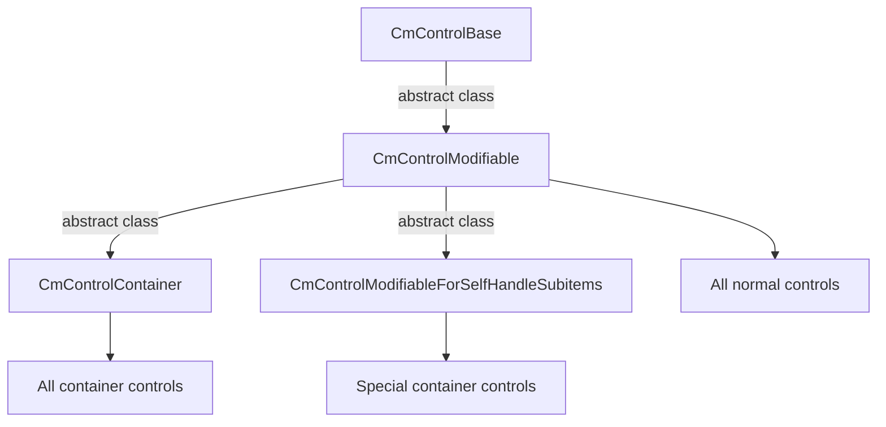

# UI Compose documentation

:arrow_backward: [Go back](README.md).

# UI Compose controls

## Introduction

UI compose is based on UI toolkit. There are a few extension controls like CmDraggableScrollView and others, but mostly
controls are the same as in UI toolkit. So what is the benefit of this?. UI compose has a different approach to:

- you won't have to search for styles assigned to elements in controls, because styling controls is done using modifiers
  instead of USS/CSS code. This will make your menu development faster. More about this [here](modifiers.md),
- event handling is really easy. More about this [here](ui_events.md),
- separation of concerns in case of screens based on these controls and easy switching between screens by using Screen
  Manager, Screens and Screen Part. See [Screen Manager](screen_manager.md), [Screen](screen.md)
  and [Screen Part](screen_part.md)
- styling dropdown is difficult in UI Toolkit and require to assign system uss as parent and here UI Compose will help
  you to forget about these problems and just style your dropdown.
- the whole system is better solution for styling, theming and language change.

## Controls



> important - read this section before the documentation for indivitual controls.

All UI compose controls inherits from CmControlBase and all of them are holding reference to their counterparts controls
from UI Toolkit.

For example CmButton holds reference to Button, or CmTextField holds reference to TextField of UI Toolkit.

You can get original control by using CmControlBase.GetVisualElement();

### available methods for base control - CmControlBase

~~~csharp
    public void SetName(string name)
    public string GetName()

    /// get or set index of control in focusable ring. The ring of controls that can take focus.
    /// You can set index of that focus then you can control which control will be focused next by changing
    /// active focused control.  
    public void SetTabIndex(int tabIndex)
    public int GetTabIndex()

    // enabled state
    public virtual void SetEnabled(bool enabled)

    /// set custom selector.
    public void SetCustomSelector(string modifierName)

    /// remove custom selector.
    public void RemoveCustomSelector(string modifierName)

    /// control focused state
    public void Focus()
    public void Blur()
    public virtual void SetFocusable(bool focusable)

    // bring to front or back
    public void BringToFront()
    public void SendToBack()

    // control visibility
    public void Hide()
    public void Show()
    public virtual void SetVisible(bool visible)
    public bool IsVisible()
~~~

almost all methods are self-explanatory. There are mostly delegates from base VisualElement methods from UI toolkit.

so all controls have above methods.

### CmControlContainer - base controls container

All container controls are inherit from base container **CmControlContainer**. You will add your own controls to that
containers by calling control.AddContent(). For example:

```csharp
    private CmColumn CreateLeftPanel()
    {
        var column = new CmColumn();
        column.AddContent(new CmButton(...));
        column.AddContent(new CmButton(...));
        return column;
    }
```

#### finding control in CmControlContainer

You can find any control inside container by calling:

- CmControlContainer.**FindControl**<control_type>("optional_control_name")
- CmControlContainer.**Q**<control_type>("optional_control_name")

```csharp
    var label = cmControl.FindControl<CmLabel>();
    label.SetText(column.title);
```

### Behaviours (AddControlBehaviour())

All controls inherited from CmControlModifiable which include function **AddControlBehaviour**

Behaviours was made to add some functionality to control that can be reused.

Currently there is one behavior available:

- **CmControlFloatingWindowBehaviour** - add this behaviour to any container to make it like floating Window that you
  can drag freely using mouse

you can add your own behaviour by inherit the base class of behaviours **CmControlBehaviourBase**

### All controls containers

- CmColumn [click for description](controls/cmcolumn.md)
- CmRow [click for description](controls/cmrow.md)
- CmDropDownField [click for description](controls/cmdropdownfield.md)
- CmFoldout [click for description](controls/cmfoldout.md)
- CmGroupBox [click for description](controls/cmgroupbox.md)
- CmPopupWindow [click for description](controls/cmpopupwindow.md)
- CmScrollView [click for description](controls/cmscrollview.md)

### Simple controls

- CmButton [click for description](controls/cmbutton.md)
- CmDraggableScrollView [click for description](controls/cmdraggablescrollview.md)
- CmHelpBox [click for description](controls/cmhelpbox.md)
- CmImage [click for description](controls/cmimage.md)
- CmLabel [click for description](controls/cmlabel.md)
- CmListView [click for description](controls/cmlistview.md)
- CmMultiColumnListView [click for description](controls/cmmulticolumnlistview.md)
- CmProgressBar [click for description](controls/cmprogressbar.md)
- CmRadioButton [click for description](controls/cmradiobutton.md)
- CmScroller [click for description](controls/cmscroller.md)
- CmSlider [click for description](controls/cmslider.md)
- CmTextField [click for description](controls/cmtextfield.md)
- CmToggle [click for description](controls/cmtoggle.md)

### Controls for Unity editor

- CmCurveFiled [click for description](controls/cmcurvefield.md)
- CmEnumFlagsField [click for description](controls/cmenumflagsfield.md)
- CmFloatField [click for description](controls/cmfloatfield.md)
- CmIntegerField [click for description](controls/cmintegerfield.md)
- CmLongField [click for description](controls/cmlongfield.md)
- CmMaskField [click for description](controls/cmmaskfield.md)
- CmObjectField [click for description](controls/cmobjectfield.md)
- CmPropertyField [click for description](controls/cmpropertyfield.md)
- CmTagField [click for description](controls/cmtagfield.md)
- CmToolbar [click for description](controls/cmtoolbar.md)

currently in editor controls are only delegates to unity version without "Cm" suffix, but it still helps with styling
and events handling of these controls