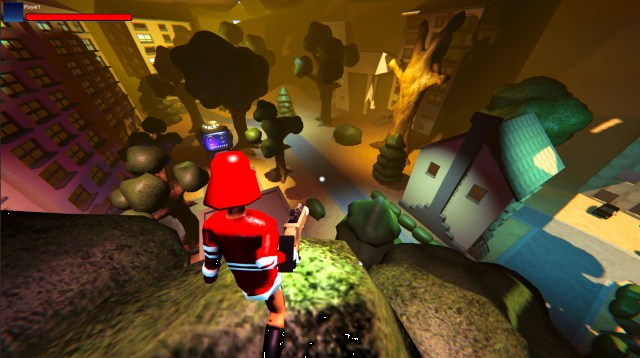
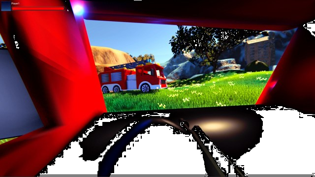

# CoDriven Advanced UI documentation version 1.0.0


Thank you for buying CoDriven Advanced UI. I hope it will speed up your workflow and help to finish your game faster 😄.

I am a professional Android developer with many years of experience, but I love creating games. During my game development journey, I came across a problem related to UI and decided to fix it by creating CoDriven Advanced UI. In android environment, I could conveniently create UI for apps and games using code. I decided to add this capability in this tool, thanks to this, you will be able to create UI by simply using code, which is generally easier than any existing solutions. Maybe just for me but try it and you will know what I mean.

<!-- TOC -->

* [CoDriven Advanced UI documentation version 1.0.0](#codriven-advanced-ui-documentation-version-100)
* [The main **benefits** of CoDriven Advanced UI is:](#the-main-benefits-of-codriven-advanced-ui-is)
  * [](#)
  * [Note: this tool **include: FULLY working 3D multiplayer FPS (mirror/LAN) with**:](#note-this-tool-include-fully-working-3d-multiplayer-fps-mirrorlan-with)
  * [Limitations of the current version of CoDriven Advanced UI:](#limitations-of-the-current-version-of-codriven-advanced-ui)
  * [CoDriven Advanced UI components](#codriven-advanced-ui-components)
    * [Screen Manager (CmScreenManager)](#screen-manager-cmscreenmanager)
    * [Screen (CmScreen)](#screen-cmscreen)
    * [Theme (ICmThemeBase)](#theme-icmthemebase)
    * [Screen Part (CmScreenPart)](#screen-part-cmscreenpart)
    * [Controls](#controls)
    * [Modifiers](#modifiers)
    * [UI events](#ui-events)
    * [Tutorials](#tutorials)

<!-- TOC -->

# The main **benefits** of CoDriven Advanced UI is:

- full source code included
- build in nodes with screen preview so you can connect them by actions [(more about in graph editor section)](graph_editor.md)


-------------------------------------------------------

- easy language change and translation editor (built-in) [(more about in translation editor section)](translation_editor.md)


-------------------------------------------------------------------

- easy theming and changing of the current theme! [(more about in theming section)](theming.md)

  

---

- powerful styling in the c# code using probably all modifiers available in USS - no more raw CSS/USS pseudocode (it will be generated automatically based on your styles) [(more about in modifiers section)](modifiers.md),
- add your own custom Editors in Unity. You can check how Translation Editor was made - because it was made with its own code I mean CoDriven Advanced UI :)
- east event handling! (you can handle events on part of your screen, screen as a whole, globally, or the same event in many places at the same time) [(more about in events section)](ui_events.md)
- CoDriven Advanced UI contains controls from UI Toolkit and a few more, like a floating window, and a draggable panel. This will be improved in the future [(more about in visual controls section)](visual_controls.md)
- implemented with observer pattern in mind to observe changes in UI or trigger UI changes from external events [(more about in cmLive data section)](cmlive_data.md)
- multiple scenes with examples like simple one theme, simple two themes, a few game scenes with maps and main menu, other [(more about in toturials section)](tutorials.md)
- easy passing player data to UI by event callback
- helper functions for your game and tools for multiplayer with a mirror
- **included: FULLY working 3D multiplayer FPS (mirror/LAN) with main menu and in-game menu** [more about in multiplayer game section](multiplayer_game.md)
- documentation in the code

## Note: this tool **include: FULLY working 3D multiplayer FPS (mirror/LAN) with**:

- grappling hook weapon created from scratch using math in code for springs (without using the build in spring classes), so you can do more,
- car driving logic: spring camera attached to the seat and shooting while driving + free camera rotation + FPP/TPP camera during driving 😄,
- car models included (not top quality 😄)
- weapon recoil using spring,
- weapon attached to the hand bone
- player can jump
- weapon, hit muzzle flashes,
- sounds for many actions,
- health status during game,
- fully working game menu, pause menu, lobby,
- settings changes like resolution/refresh rate, sound, music, mouse sensitivity, and more. Changes is saved.
- multiple weapons like pistol, machinegun, grenade launcher, sniper with simple zooming, rocket launcher
- weapon recoil
- maps for the game and simple models like trees, houses, etc.
- you can play with friends over Lan :)






More about multiplayer games [more in multiplayer game section](multiplayer_game.md)

Please read the below brief overview of all important sections that will help you to understand how it works all
together.

## Limitations of the current version of CoDriven Advanced UI:

CoDriven Advanced UI is styling controls by generating USS code in the background. The system will generate all styles for all
your themes and selectors from the code to the Resources/UssStyles folder and it will be loaded runtime.

Limitation: currently UI Toolkit enforces the limitation that USS code can't created and parsed runtime to style sheet
because The USS importer makes heavy use of the AssetDatabase to resolve asset paths. To make the importer
runtime-ready.

So that you will create theme, or more themes with styles for your controls and assign them to your controls. Everything in code. You can assign animations. For example hover animation. Then under the hood this tool will automatically generate uss styles in editor, and load them runtime - without your actions. You can of course change styles runtime by using fields from controls but not by USS code.

> Because of that the new version of CoDriven Advanced UI will propably depend only on dynamic code generation, but current version is enought - it works like UI Toolkit, so don't worry.

You can:

- create styles for any visual look before build and set at runtime to change it dynamically runtime,
- create custom selectors and activate/deactivate it runtime (that will change the visual look and feel of control for certain conditions)
- dynamically change the visual of any control by accessing the stylesheet property of any CmControl.getVisualElement().stylesheet. So we can for example dynamically load any image and change it runtime.

Because of all of that - CoDriven Advanced UI has an additional custom selector that will allow you to execute runtime. So you want to make control half opacity and red in certain conditions runtime. You will create that style for it with your custom name and activate or deactivate that style runtime.

Below is an example how to change visual style of the toogle check mark icon for multiple states - when the mouse is hovered, when control is disabled, or checked:

```csharp
 var cmToggle = new CmToggle(..);
 cmToogle.modifiers.CheckMark(
     // create modifier for DEFAULT_STATE but we will add other state using ____NextSelector
     new CmModifierImageAndBackground(CmSelector.DEFAULT_STATE)
         .BorderWidth(0)
         .BorderRadius(60.px())
         .BorderColorRGBA(new Color32(255, 51, 4, 255))
   
         //Now add modifiers for HOVER state
         .____NextSelector(CmSelector.HOVER)
         .Scale(1.2f)
   
         //Now add modifiers for the DISABLED state
         .____NextSelector(CmSelector.DISABLED)
         .BackgroundColorRGBA(Color.white)
   
         //Now add modifiers for the CHECKED state
         .____NextSelector(CmSelector.CHECKED)
         .BackgroundColorRGBA(Color.gray)
 );
```

to learn more about changing visual look see [theming](theming.md), [modifiers](modifiers.md)
and [visual controls](visual_controls.md)

## CoDriven Advanced UI components

Almost every game has a menu made up of several windows. **CoDriven Advanced UI** allows you to create multiple **CmScreen** windows. Switching between them, and other actions. The windows are managed by the **CmScreenManager**.

Each window can be divided into **CmScreenPart** sections. You can add controls both in the window and in the window section. A more detailed description below.

### Screen Manager (CmScreenManager)

The main component of CoDriven Advanced UI is **CmScreenManager** which is a container for all screens and themes in your game.
You can create many screen managers. For example: One for the main menu, and one for in-game. You Provide a list of **CmScreen** and a list of Themes CmThemeBase. Here you can handle global UI events by clicking on the buttons.
To learn more about it [click here - sceen manager section](screen_manager.md)

### Screen (CmScreen)

This is a single screen visible as a whole on the monitor screen currently. The screen is tightly coupled with a theme. If you don't use a theme then you can create a screen based on the default theme. Here you can handle screen-related UI events like clicking on the buttons.

To learn more about it [click here - sceen section](screen.md)

### Screen Part (CmScreenPart)

This is an optional element. It was added to divide the whole screen into sections. This way you can reuse certain sections on multiple screens. Like the game settings panel for changes in the main menu and in the game. This way it's more reusable. CmScreenPart is also usable to handle UI events (like button clicks or other events) and encapsulate this logic to this screen part. 

Of course, you can handle events in higher order parts of your system like **CmScreen** or **CmScreenManager** you can handle screen part-related UI events like clicking on the buttons.

To learn more about CmScreenPart [click here - screen part section](screen_part.md)

### Theme (ICmThemeBase)

When you make your game you will probably want to create multiple themes. For example one for WHITE UI Theme, another one for DARK UI theme

CoDriven Advanced UI use base theme with abstract methods to extend them in implementations that will style your controls.

This way you can create multiple implementations and choose what implementation of theme you want to use for styling.

Even if you have one theme you must create class that will extend base tool class **CmThemeBase**

```csharp
public abstract class CmExample1ThemeBase : CmThemeBase
{
    public abstract void StyleButton(CmButton button);
}
```

then you will implement simple theme based on this:

```csharp

    public class CmExample1ThemeOne : CmExample1ThemeBase
    {
        public override CmButtonModifiers StyleButton()
        {
            // get style builder for button and set styles for two states - default, on mouse hover
            var modifiers = CmButton.GetModifiersBuilder();
            modifiers.Button(
                new CmModifierText(CmSelector.DefaultState)
                    .AnimDuration(300) // 300 miliseconds
                    .BackgroundColorRGBA(Color.white)
                    .TextFontSize(30.Px())
                    
                    // below section is for mouse hover state
                    .____NextSelector(CmSelector.Hover)
                    .Scale(1.2f, 1.2f) // scale x and y
                    .BackgroundColorRGBA(new Color(1f, 7.0f, 0.4f, 1.0f)) // rgba
            );
            return modifiers;
        }

```

You will tell Screen Manager, or Screen that your base class **CmExample1ThemeBase** will be used for theming.

CoDriven Advanced UI will automatically generate uss styles file in editor and load it runtime so UI Toolkit part is hidden from you.

But you must assign styling method to your control so it will take this style

```csharp
     // create simple button with text and UI event handler from this screen to handle events in this screen
    var button = new CmButton(this, text, GetCmUiEventsHandler());
    
    // get theme assigned to this screen and use its function to style this button
    button.SetStyle(GetTheme().StyleButton);
```

To learn more about theming [click here - theming section](theming.md)

### Controls

CoDriven Advanced UI is an adapter for UI toolkit components with an extension. 
Almost each UI Toolkit control is encapsulated with the CoDriven Advanced UI control.
So for example UI Toolkit **Button** is encapsulated into **CmButton** in this tool.

To see all available controls at the moment please [click here - controls section](controls.md)

### Modifiers

Modifiers are properties that will change the look and feel of UI Toolkit controls like USS/CSS code, but they are managed in the code by custom method calls instead of uss pseudocode. 

here is an example how modifiers look like for styling simple CmButton

```csharp

            // get style builder for button and set styles for two states - default, on mouse hover
            var modifiers = CmButton.GetModifiersBuilder();
            modifiers.Button(
                new CmModifierText(CmSelector.DefaultState)
                    .AnimDuration(300) // 300 miliseconds
                    .BackgroundColorRGBA(Color.white)
                    .TextFontSize(30.Px())
                    
                    // below section is for mouse hover state
                    .____NextSelector(CmSelector.Hover)
                    .Scale(1.2f, 1.2f) // scale x and y
                    .BackgroundColorRGBA(new Color(1f, 7.0f, 0.4f, 1.0f)) // rgba
            );

```

to get more information about modifiers [click here - modifiers section](modifiers.md)

### UI events

UIEvents are mapped internally to simple class. This way you can easily use events in any place of your elements tree.

The whole menu is built onto **CmScreenManager**, which contains one or multiple **CmScreen** which could contain controls or **CmScreenPart**. These are containers of **CmControls**.

So basically there is a relation like this **CmScreenManager** <- **CmScreen** <- **CmScreenPart** <- **CmControl**

You can handle events the same way. The UI events are generated by **CmControl**. The event can be handled inside the function that creates **CmControl**, or upper in **CmScreenPart** or upper **CmScreen**, or globally in **CmScreenManager**.
This way you can have a **CmButton** "Change theme to My favorite" and handle click event globally in **CmScreenManager** even if **CmButton** is created in **CmScreenPart** or **CmScreen**.

More about [in UI events section](ui_events.md).

### Tutorials

CoDriven Advanced UI contains a few sample scenes but it will be better to read the tutorial section first [(click here - tutorials section)](tutorials/tutorials.md)
