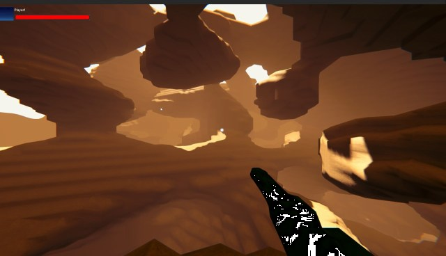

# CoDriven Advanced UI documentation

[Go back](index.md)

# Multiplayer Game With full menu sample and scenes

<!-- TOC -->
* [CoDriven Advanced UI documentation](#codriven-advanced-ui-documentation)
* [Multiplayer Game With full menu sample and scenes](#multiplayer-game-with-full-menu-sample-and-scenes)
    * [Introduction](#introduction)
  * [Main menu scene (MainMenuScene.unity)](#main-menu-scene-mainmenusceneunity)
    * [MainMenuScreensManager](#mainmenuscreensmanager)
    * [Game Controls](#game-controls)
<!-- TOC -->

### Introduction

CoDriven Advanced UI is published with a fully working 3d multiplayer game using MIRROR/LAN (LAN because there is no
ROOM/LOBBY/MATCH MAKING SERVICES. You can improve it by adding this functionality). The game itself is valuable, but the
most important part of the game is the UI.

UI in the game was fully created using CoDriven Advanced UI.

The game is split into scenes. The game example is the most advanced of all other examples so please read the tutorial
sections first [here](tutorials/tutorials.md)

## Main menu scene (MainMenuScene.unity)

This scene is built mostly for Main Menu-related actions and settings.

### MainMenuScreensManager

Scene i build upon the MainMenuScreensManager.cs. This is the core of the whole main menu.
It contains 6 screens added in OnAddSupportedScreens and 4 themes added in OnAddSupportedThemes.

OnBindUiEventsHandler is used to handle global-related actions like theme changing, or language. Open
MainMenuScreensManager.cs for details.

The MainMenuScreensManager is a container of:

1. **CmScreenMain.cs** - the main menu panel with options like exit, about, settings, multiplayer

almost all screens are built from CmScreenParts that can be reused to reduce code repetition. All classes that represent
CmScrenPart is suffixed with "Sp" at the end of the class name.

Here is how the main screen is built:

~~~csharp
        public override void OnMakeScreenContent(List<CmControlBase> contentList)
        {
            var mainMenuGP = new MainMenuPanelSp(this);
            var screen = new MainScreenContentSp(this, mainMenuGP, null, null);
            contentList.Add(screen.MakeContent());
        }
~~~

**MainMenuPanelSp.cs** is a Main menu panel on the left side of the screen with options like exit, settings, about,
multiplayer
and this container is added to **MainScreenContentSp.cs** which is the main container for up to three Menu panels (left,
center, right),
We only pass mainMenuGP to the left panel param of the MainScreenContentSp constructor. So center and right panels will be
null.

Finally, the whole container is added to the contentList

This way all the things will be rendered on screen. To see how it works please see the code of **MainScreenContentSp.cs
** and **MainMenuPanelSp.cs**

**MainMenuPanelSp** is mostly responsible for changing the current screen to about/settings/multiplayer etc.

2. **CmScreenAbout.cs** - this is screen with game description.

This panel is built in a similar way to CmScreenMainMenu. The MainScreenContentSp is filled with 2 panels:

- **MainMenuPanelSp.cs** on the left for options
- **PanelAboutSp.cs** on the center as about panel with game description.

~~~csharp
        public override void OnMakeScreenContent(List<CmControlBase> contentList)
        {
            var mainMenuGP = new MainMenuPanelSp(this);
            var mainMenuAboutSs = new PanelAboutSp(this);
            var screen = new MainScreenContentSp(this, mainMenuGP, mainMenuAboutSs);
            contentList.Add(screen.MakeContent());
        }
~~~

please open **PanelAboutSp.cs** to see how you can add a colored rich text

3. **CmScreenMapSelect.cs** - this is screen with game description.

This panel is built in a similar way to CmScreenMainMenu. The MainScreenContentSp is filled with 2 panels:

- **MainMenuPanelSp.cs** on the left for options as always :)
- **MapSelectPanelSp.cs** on the center as about panel with game description.

~~~csharp
        public override void OnMakeScreenContent(List<CmControlBase> contentList)
        {
            var mainMenuGP = new MainMenuPanelSp(this);
            var mapSelectPanelSp = new MapSelectPanelSp(this);
            var screen = new MainScreenContentSp(this, mainMenuGP, mapSelectPanelSp, null);
            contentList.Add(screen.MakeContent());
        }
~~~

these two panels are added to the main container MainScreenContentSp and finally to contentList to make it visible later

> Note: The **MapSelectPanelSp.cs** is an interesting part of this screen because it contains CmDraggableScrollView for
> screenshots from game maps. This control allows you to scroll and snap to the center of an image, and move between images with
> centering the current image in the center of the control. The content for this control is a list of CmImage controls representing
> map screenshots.
> Open the **MapSelectPanelSp.cs** class for more details

4. **CmScreenSettingsControls.cs** - is a simple screen with key bindings for the game.

This panel is built in a similar way to previous screens but contains three panels instead of two like before:

- **MainMenuPanelSp.cs** on the left for options
- **MiddlePanelSettingsSp.cs** on the center - panel with settings like audio, video, controls, etc.
- **PanelSettingsControlsSp.cs** on the right - panel with key bindings description and contains two sliders to change
  mouse sensitivity for camera movement during the game

~~~csharp
        public override void OnMakeScreenContent(List<CmControlBase> contentList)
        {
            var mainMenuGP = new MainMenuPanelSp(this);
            var settingsGp = new MiddlePanelSettingsSp(this);
            var controlsSp = new PanelSettingsControlsSp(this);
            var screen = new MainScreenContentSp(this, mainMenuGP, settingsGp, controlsSp);
            contentList.Add(screen.MakeContent());
        }
~~~

please open **PanelSettingsControlsSp.cs** to see how to change mouse sensitivity

### Game Controls

During play, you can use a keyboard and mouse
> mouse: left button - shoot weapon
>
>mouse: right button - use grappling hook
>
>key: w - move forward
>
>key: s - move backward
> 
>key: a - move left
>
>key: d - move right
>
>key: space - jump
>
>key: f - on/off flashlight
>
>key: w - move forward
>
>key: c - zoom when using a sniper weapon
>
>key: t - camera toggle
>
>key: 1,2,3,4 - change weapons
>
>key: E - join vehicle
>
>key: Q - leave vehicle
> 
