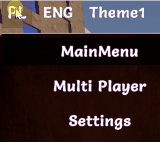

# CoDriven Advanced UI documentation


[Go back](index.md)

# Translation editor


### Language change runtime:



<!-- TOC -->
* [CoDriven Advanced UI documentation](#codriven-advanced-ui-documentation)
* [Translation editor](#translation-editor)
    * [Language change runtime:](#language-change-runtime)
    * [Introduction](#introduction)
      * [Creating translations](#creating-translations)
      * [Get translation text for translation ID:](#get-translation-text-for-translation-id)
      * [Set current language:](#set-current-language)
<!-- TOC -->

### Introduction

Translation editor will allow you to create translations for your texts, manage languages, and generate translation files.

To create your translations open the translation editor by clicking in Unity from the top menu:

**windows -> CoDriven Advanced UI -> Translation Editor**

Translations are divided into columns.

The first column "Translation ID" are ids for your translations because you will have to use the translation_ID name to access
translation text.
Other columns are just translations in any language.

You can add language using "Add language" available above the table. To remove language click the red button with "X" on the
the right side of your language in the table, but remember it will remove all the data that was added for that language.

You can add translation ID and text for all languages assigned to this ID by using the button "Add new line" above the
table.

#### Creating translations

So let's create an example translation for the "Settings" text:

1. Click "Add new line button" and a new row will be created in the table.
2. Click on the newly created text in the "Translation ID" row and enter your ID for translation. For example, enter "
   str_settings",
3. click on the next row to the right of the "English" column and enter the "Settings" text.
5. Optionally add other languages and translations for them.
6. Finally click "Save and generate CmGeneratedTranslations.cs".

This action will generate the static class for translation management called **_CmGeneratedTranslation.cs_** class.

```csharp

/**
* THIS FILE IS GENERATED IN Translation editor. You can open the translation
* editor in unity top bar "windows->CoDriven Advanced UI->translation editor"
  **/
  public static class CmGeneratedTranslations
  {
  // LANGUAGE IDS
  public static readonly int LANGUAGE_English = 0;
  public static readonly int LANGUAGE_Polish = 1;

  // TRANSLATION IDS
  public static readonly int str_settings = 0;

  /**
    * Get string from translation id constant
      **/
  public static string GetString(int translactionID)
  {
        return CmLanguageManager.GetString(translactionID);
  }

  public static void SetCurrentLang(int langId)
  {
        CmLanguageManager.SetCurrentLang(langId);
  }

  public static void setCurrentLang_English()
  {
        CmLanguageManager.SetCurrentLang("English");
  }

  public static void setCurrentLang_Polish()
  {
        CmLanguageManager.SetCurrentLang("Polish");
  }

}
```

As you can see this generated class will contain all your translation IDS as variable names with types of int and index
value.

```csharp
  // TRANSLATION IDS
  public static readonly int str_settings = 0;
```

we added one so there is only one variable

You can then use this class to access the translation by this ID for the currently selected language.

#### Get translation text for translation ID:

to get our "settings" translation for the currently selected language you can use:

```csharp
  var settingsText = CmGeneratedTranslations.GetString(CmGeneratedTranslations.str_settings);
```

As you noticed there are extension methods "text_str_settings()" generated for our str_settings translation ID that can
be used as a shortcut for our previous code with CmGeneratedTranslations.GetString(CmGeneratedTranslations.str_settings);

#### Set current language:

For example, to set English as the current language you can use

```csharp
  CmGeneratedTranslations.setCurrentLang_English();
```

or

```csharp
  CmGeneratedTranslations.SetCurrentLang(CmGeneratedTranslations.LANGUAGE_English)
```

as you can see there are variables generated based on the translation editor table

CmGeneratedTranslations.LANGUAGE_English,

CmGeneratedTranslations.LANGUAGE_Polish

are constants because we had two languages in our example table "English" and "Polish"
